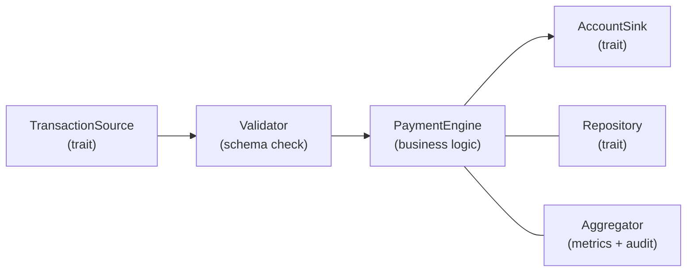
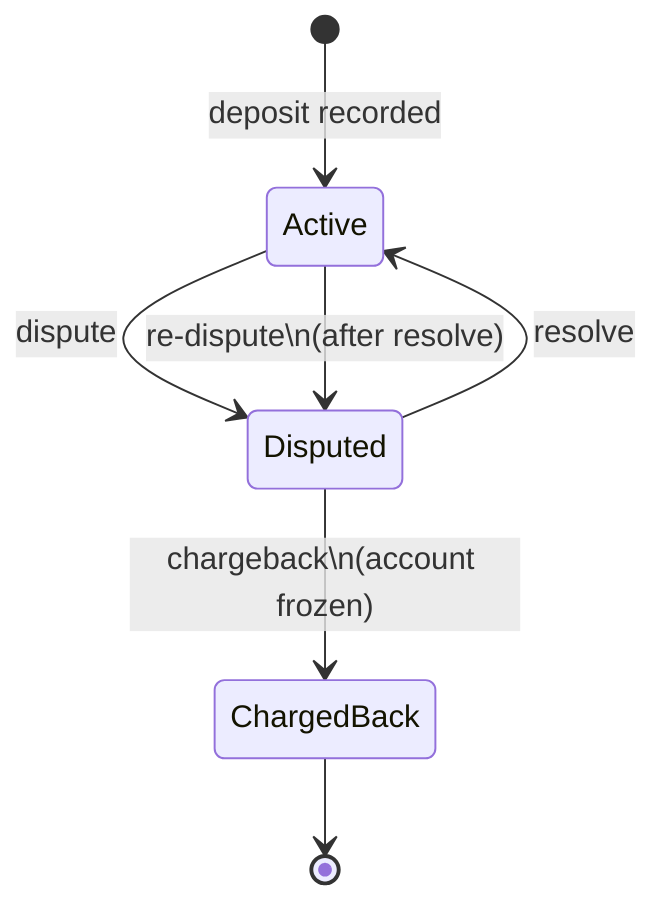

# Simple Payment Engine

A high-throughput, financially-correct payment transaction engine built in Rust — processing **10M+ transactions per second** with streaming I/O, pluggable storage, and built-in observability.

## Features

- **Financially correct** — fixed-precision `Decimal` arithmetic (no floating-point), derived totals that can never drift
- **Scalable** — streaming architecture processes arbitrarily large files with constant memory per row
- **Resilient** — malformed input is logged and skipped; one bad row never crashes the pipeline
- **Extensible** — trait-based I/O, storage, and metrics: swap CSV for JSON, HashMap for PostgreSQL, stderr for Prometheus — zero engine changes
- **Observable** — immutable ledger event audit trail with aggregated metrics and structured logging
- **Fast** — 1M transactions in ~115ms (raw engine), 100K end-to-end in ~37ms including CSV I/O

## Usage

```bash
# Process transactions
cargo run -- transactions.csv > accounts.csv

# Capture metrics separately
cargo run -- transactions.csv > accounts.csv 2>metrics.log

# Run tests
cargo test

# Run benchmarks
cargo bench
```

### Input Format (CSV)
```csv
type, client, tx, amount
deposit, 1, 1, 1.0
withdrawal, 1, 2, 0.5
dispute, 1, 1,
resolve, 1, 1,
chargeback, 1, 1,
```

### Output Format (CSV)
```csv
client,available,held,total,locked
1,1.5,0.0,1.5,false
```

## Architecture



### Transaction State Machine



### Module Breakdown

| Module | Responsibility |
|---|---|
| **`types`** | Newtype wrappers (`ClientId`, `TransactionId`) — compile-time type safety |
| **`model/`** | Domain objects: `ClientAccount` (derived total, never stored), `TransactionRecord` (state machine) |
| **`repository/`** | Storage traits + in-memory `HashMap` implementations — swappable for Redis, PostgreSQL, etc. |
| **`engine/`** | Stateless validator (Parse, Don't Validate) + `PaymentEngine` processor with builder pattern |
| **`io/`** | `TransactionSource` / `AccountSink` traits, `CompositeSink` for fan-out, streaming CSV implementations |
| **`aggregator/`** | `LedgerEvent` audit trail, `Aggregator` statistics, `AggregatorSink` trait for metric export |
| **`error`** | Typed error enum with structured context (client ID, transaction ID) |

## Design Decisions

### Financial Correctness
- **`Decimal` not `f64`** — `rust_decimal::Decimal` with 4 decimal places. Floating-point is unacceptable for financial math.
- **Derived `total`** — `total = available + held` is computed on demand, never stored. Eliminates an entire class of consistency bugs.

### Scalability
- **Streaming I/O** — rows deserialized one at a time. Memory usage is O(clients + deposits), not O(transactions).
- **Only deposits stored** — withdrawals are fire-and-forget since disputes reference the original deposit.

### Reliability
- **Graceful degradation** — malformed rows and business rule violations are logged and skipped.
- **Frozen accounts** — chargebacks immediately lock the account; all subsequent operations are rejected.
- **Cross-client validation** — client A cannot dispute client B's transaction.
- **Duplicate detection** — duplicate transaction IDs are rejected.
- **Re-disputes** — after a resolve, the same transaction can be disputed again.

### Dispute Scope
Disputes apply to deposits only — disputing a withdrawal (money that already left the account) doesn't make financial sense. Chargebacks reverse the original deposit.

## Extensibility

The trait-based design enables **zero engine changes** for new capabilities:

| Want to add... | Implement... | Engine changes |
|---|---|---|
| JSON input | `impl TransactionSource for JsonSource` | **0** |
| HTTP POST output | `impl AccountSink for HttpSink` | **0** |
| Prometheus metrics | `impl AggregatorSink for PrometheusSink` | **0** |
| PostgreSQL storage | `impl AccountRepository + TransactionRepository` | **0** |
| New transaction type | Add enum variant + match arm | ~20 lines |

## Testing

```bash
cargo test
```

- **Unit tests** — deposit, withdrawal, dispute, resolve, chargeback operations
- **Edge cases** — frozen accounts, insufficient funds, cross-client disputes, duplicates, negative amounts
- **Integration tests** — end-to-end CSV processing with fixture files
- **Invariant checks** — `total == available + held` verified after every operation

## Benchmarks

Run the full [Criterion](https://bheisler.github.io/criterion.rs/) benchmark suite:

```bash
cargo bench
```

HTML reports with flame charts are generated at `target/criterion/report/index.html`.

### Results (Apple Silicon — representative, not absolute)

| Benchmark | Dataset | Throughput |
|---|---|---|
| **Engine (deposits only)** | 1K | ~9.6M tx/sec |
| | 100K | ~10.9M tx/sec |
| | 1M | ~8.7M tx/sec |
| **Full pipeline (CSV → engine → CSV)** | 1K | ~2.5M tx/sec |
| | 100K | ~2.7M tx/sec |
| **Mixed workload** | 100K | ~2.8M tx/sec |
| **CSV parsing** | 100K rows | ~90 MiB/sec |
| **CSV serialization** | 1K accounts | ~126 µs |
| **Client scaling** (100K tx) | 10 clients | ~11.3M tx/sec |
| | 50K clients | ~8.9M tx/sec |

### Key Takeaways

- **1M transactions in ~115ms** (raw engine), **100K in ~37ms** end-to-end
- **CSV parsing is the bottleneck** — engine alone is ~4× faster than full pipeline
- **Graceful scaling** — 50K unique clients causes only ~20% throughput degradation

### Benchmark Groups

| Group | Measures |
|---|---|
| `engine_deposits` | Raw engine throughput, no I/O overhead |
| `full_pipeline` | CSV parse → validate → process → CSV serialize |
| `mixed_workload` | Realistic mix: 50% deposits, 25% withdrawals, 15% disputes, 5% resolves, 5% chargebacks |
| `csv_parsing` | CSV deserialization in isolation |
| `csv_serialization` | CSV serialization of account outputs |
| `client_scaling` | HashMap pressure: 100K tx across 10–50K unique clients |

### Complexity

| Metric | Value |
|---|---|
| Time | O(n) where n = transactions |
| Space | O(c + d) where c = unique clients, d = deposit transactions |
| Memory | Streaming — constant per row, handles arbitrarily large files |

## Dependencies

| Crate | Purpose |
|---|---|
| `csv` | Streaming CSV parsing with whitespace trimming |
| `serde` | Zero-copy deserialization into typed structs |
| `rust_decimal` | Fixed-precision decimal arithmetic for financial correctness |
| `thiserror` | Ergonomic error type derivation |
| `tracing` | Structured logging with span context |
| `criterion` | Statistical micro-benchmarking with HTML reports (dev-only) |

## License

Licensed under either of

- [Apache License, Version 2.0](LICENSE-APACHE.txt)
- [MIT License](LICENSE-MIT.txt)

at your option.
